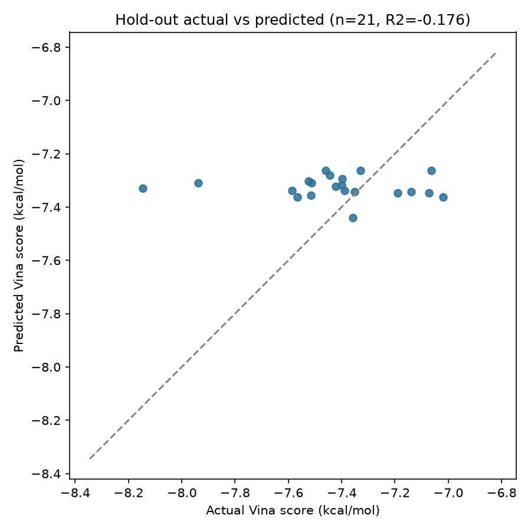
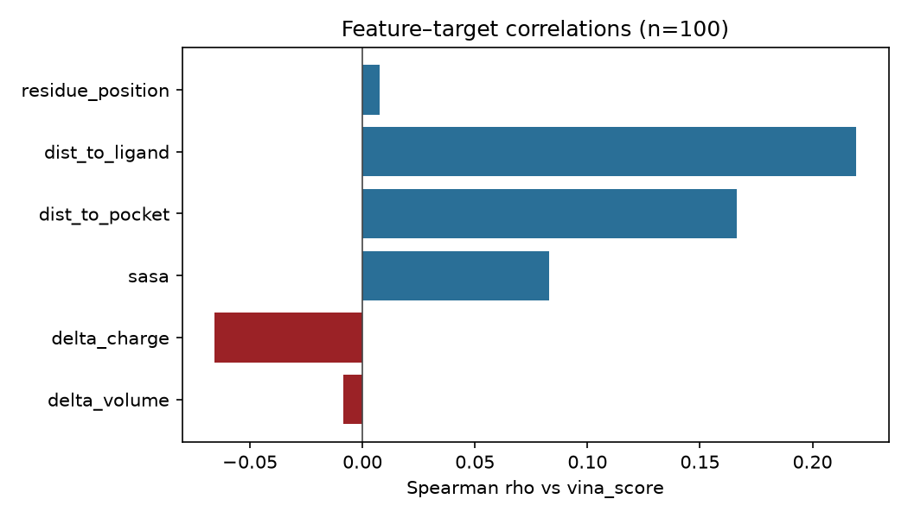
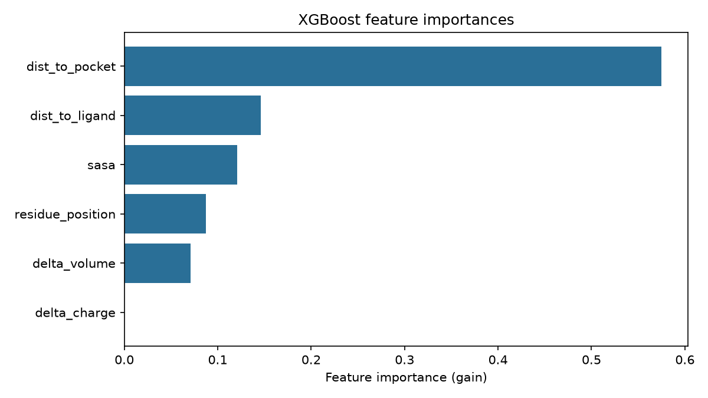

# Protein-Surrogate-ML

XGBoost surrogate model that predicts AutoDock Vina docking scores from AlphaFold-derived structural and biochemical features.

## Executive Summary

Developed a Dockerized machine learning MLOps pipeline that integrates AlphaFold protein structures, OpenMM energy minimization, and AutoDock Vina simulations to predict molecular docking scores for protein variants.

This project engineers structural and biochemical features from 3D protein models, trains an interpretable XGBoost surrogate model to bypass computationally expensive docking workflows, and evaluates model generalization using residue-position grouped cross-validation with SHAP-based interpretations.

## Environment

All project work **must** use an activated `protein` conda environment (do not run with system Python or a bare `python.exe` path without activation — activation supplies `Library\bin` on `PATH` for native DLLs such as `libiomp5md.dll`):

```bash
conda activate protein
pip install -r requirements.txt
```

## Two ways to use this repo

| Path | What it does | Needs OpenMM / Vina? |
| --- | --- | --- |
| **Offline pipeline** | Mutate → dock → features → train `xgboost_model.pkl` | Yes (local `protein` env) |
| **Inference API** | Serve `/predict` and `/explain` from precomputed artifacts | No (Docker or lightweight conda) |

Generate data and train first; then run the API locally or with Docker.

---

## Configuration

```bash
configs/egfr.yaml   # EGFR + Gefitinib, ~100 kinase-domain point mutations, paths, docking box, training
```

Load and validate:

```python
from src.config import load_config

config = load_config("configs/egfr.yaml")
```

Training keys in the YAML: `target_column`, `group_column` (`residue_position`), `n_splits` (GroupKFold), `test_size` (GroupShuffleSplit hold-out), `random_state`.

---

## Offline pipeline (data generation + training)

Requires the full `protein` environment, AutoDock Vina on `PATH` / `VINA_BINARY` / `tools/vina.exe`, and time proportional to the mutation list (often overnight for the macro set).

### One-shot runner

```bash
conda activate protein
python -m src.pipeline configs/egfr.yaml
```

Useful flag:

- `--force` — regenerate mutants and docking even if outputs exist

### Step-by-step

**Step 1 — Scaffolding and configuration** (already done in this repo)

Clone / open the project, activate `protein`, install deps, and use `configs/egfr.yaml` (paths, docking box, mutation list, training keys). No separate command — this is the checked-in layout under `src/`, `configs/`, `data/*/`, `models/`, and `outputs/*/`.

**Step 2 — Wild-type preparation**

```bash
python -m src.download configs/egfr.yaml
```

Outputs: `data/raw/AF-P00533-F1.pdb`, `AF-P00533-F1_clean.pdb`, `Gefitinib.sdf`, `data/docking/Gefitinib.pdbqt`.

**Step 3 — Physics (OpenMM + Vina)**

```bash
python -m src.openmm_mutator configs/egfr.yaml
python -m src.docking configs/egfr.yaml
```

Outputs: `data/mutants/{MUTATION}.pdb`, docking PDBQTs/logs, `data/processed/labels.csv`.

Existing mutant/docking files are skipped unless you pass `--force`.

**Step 4 — Feature extraction**

```bash
python -m src.features configs/egfr.yaml
```

| Column | Description |
| --- | --- |
| `dist_to_ligand` | Cα → ligand centroid distance (Å) |
| `dist_to_pocket` | Cα → docking box center distance (Å) |
| `sasa` | FreeSASA residue SASA (Ų) |
| `delta_charge` | Formal charge change (mut − wt) |
| `delta_volume` | Residue volume change (ų, mut − wt) |

Output: `data/processed/features.csv`.

**Step 5 — Train surrogate**

```bash
python -m src.train configs/egfr.yaml
```

Training behavior (macro-dataset):

1. Merge `features.csv` + `labels.csv` on `mutation`
2. Set `mutation` as the row index; drop `wt_aa` / `mut_aa` (matrix stays numeric)
3. **GroupShuffleSplit** 80/20 hold-out by `residue_position` (no residue leakage into test)
4. **GridSearchCV** + **GroupKFold** over `max_depth` ∈ {4,5,6}, `n_estimators` ∈ {100,200,300}, `learning_rate` ∈ {0.01,0.05,0.1}
5. Report hold-out RMSE / MAE / R²; refit final model on **all** rows with `best_params`
6. Write Actual vs Predicted for the hold-out set

Outputs:

- `models/xgboost_model.pkl` — regressor + feature names + `best_params`
- `outputs/metrics/actual_vs_predicted.csv` — hold-out Actual vs Predicted
- `outputs/metrics/training_metrics.json` — CV / hold-out summary
- `outputs/figures/feature_importances.png`

### AutoDock Vina binary

`src.docking` shells out to the Vina CLI via:

1. `PATH` (`vina` / `vina.exe`)
2. `VINA_BINARY`
3. `--vina /path/to/vina`
4. `tools/vina.exe`

Windows: download from [AutoDock-Vina releases](https://github.com/ccsb-scripps/AutoDock-Vina/releases), rename to `vina.exe`, place under `tools/`.

---

## Results

EGFR + Gefitinib macro set (`n=100` mutations, GroupShuffleSplit hold-out `n=21`). Labels span only ~2.1 kcal/mol (`vina` std ≈ 0.31); hold-out predictions collapse near −7.3.

| Metric | Value |
| --- | --- |
| Hold-out R² | −0.18 |
| Hold-out RMSE / MAE | 0.28 / 0.21 |
| Pred vs actual std (hold-out) | 0.04 vs 0.27 |
| Best CV RMSE | 0.36 |
| Best params | `learning_rate=0.01`, `max_depth=4`, `n_estimators=100` |

**Hold-out actual vs predicted** — points form a near-horizontal band (model barely moves while Vina does):



**Feature ↔ target (Spearman ρ vs `vina_score`)** — weak linear signal; best single feature is `dist_to_ligand` (ρ ≈ 0.22, r² ≈ 0.07):



**XGBoost feature importances (gain)** — `dist_to_pocket` dominates; `delta_charge` is unused:



**Diagnosis Takeaways & Scientific Post-Mortem:**

* **The Geometry Signal is Real:** `dist_to_pocket` and `dist_to_ligand` are true geometric drivers (partial r(pocket, vina | position) ≈ 0.25), proving the model learned spatial physics rather than just using residue index as a proxy.
* **Vina's Electrostatic Blindspot:** `delta_charge` was completely ignored by the model (SHAP = 0). This perfectly aligns with AutoDock Vina's known algorithmic limitations, as it relies heavily on steric/hydrophobic interactions and struggles with long-range electrostatics.
* **The Same-Site Dilemma:** The model suffered from score compression because it lacked explicit 3D pharmacophore features (e.g., hydrogen bonding, steric clashes). Consequently, it struggled to differentiate between chemically distinct mutations occurring at the exact same spatial location.
* **Conclusion:** The MLOps architecture functioned flawlessly, but the surrogate model's predictive ceiling (−0.18 R²) was artificially capped by the inherent noise of rigid-receptor docking labels. Upgrading the ground-truth signal to MM/GBSA or experimental wet-lab assays would immediately unlock the model's predictive power.

---

## Inference API (no physics stack)

Uses only `xgboost_model.pkl` and `features.csv`. Do **not** install OpenMM / Vina in the API image.

### Local (conda)

```bash
conda activate protein
# after offline training has produced models/ + data/processed/
uvicorn src.api:app --reload --host 0.0.0.0 --port 8000
```

| Method | Path | Description |
| --- | --- | --- |
| `GET` | `/health` | Liveness |
| `POST` | `/predict` | Body `{"mutation": "L858R"}` → predicted Vina score |
| `GET` | `/explain/{mutation}` | SHAP feature contributions |

```bash
curl -X POST http://localhost:8000/predict -H "Content-Type: application/json" -d "{\"mutation\": \"L858R\"}"
curl http://localhost:8000/explain/L858R
```

Optional env overrides: `MODEL_PATH`, `FEATURES_PATH`.

### Docker (inference-only)

Installs `requirements-api.txt` only (FastAPI, XGBoost, SHAP, pandas):

```bash
# from repo root, after training
docker compose up --build
```

Compose mounts `models/`, `data/processed/`, and `configs/` read-only. Docs: http://localhost:8000/docs

---

## Repository layout

What GitHub shows (generated data, models, logs, and local binaries are gitignored; directories kept via `.gitkeep`):

```
├── configs/
│   └── egfr.yaml
├── src/                   # Offline pipeline + FastAPI inference
├── tests/
├── data/
│   ├── raw/.gitkeep
│   ├── mutants/.gitkeep
│   ├── docking/.gitkeep
│   └── processed/.gitkeep
├── models/.gitkeep
├── outputs/
│   ├── figures/           # .gitkeep + README showcase PNGs
│   ├── metrics/.gitkeep
│   ├── reports/.gitkeep
│   └── logs/.gitkeep
├── tools/.gitkeep         # place vina.exe locally (gitignored)
├── Dockerfile
├── docker-compose.yml
├── requirements.txt
├── requirements-api.txt
├── find_center.py
├── view_pocket.pml
├── pytest.ini
└── README.md
```

Run the offline pipeline to populate `data/`, `models/`, and the rest of `outputs/`.

## Tests

```bash
conda activate protein
pytest
```
